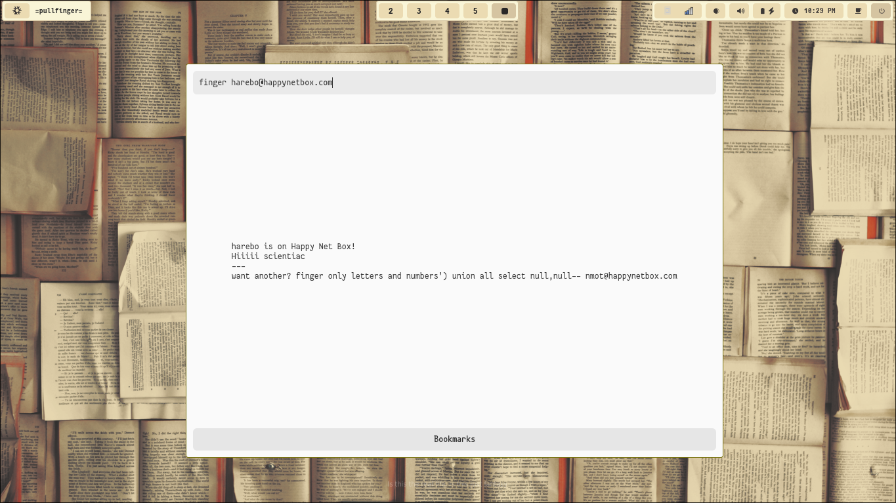

# Pullfinger

A GTK 3 based finger client implementation.

# Explanation

# Comparing Finger with HTTPS

Let’s put the [Finger protocol](https://en.wikipedia.org/wiki/Finger_(protocol)) in perspective by comparing it with the modern HTTPS protocol:

    Finger Protocol:
        Origin: Developed in the early days of the internet when security concerns were less prevalent.
        Message Security: Transmits messages in plain text, making them vulnerable to snooping and eavesdropping.
        Privacy Measures: Lacks robust security mechanisms, making it unsuitable for handling confidential or private information.
        Usage: Used primarily for simple information retrieval between computers in the early internet era.

    HTTPS Protocol:
        Origin: Evolved to address the need for secure communication in the modern digital landscape.
        Message Security: Wraps messages in layers of encryption, ensuring that only intended recipients can decipher them.
        Security Measures: Utilizes digital certificates to verify the identity of servers and websites, enhancing trust and security.
        Usage: Widely employed for secure online transactions, protecting login credentials, and safeguarding sensitive data.

For more info on why I built it visit [map.scientiac.space](https://map.scientiac.space/thoughts/gtk-finger-client/).

# Installation Guide

### Windows

We highly suggest you to install [WSL](https://learn.microsoft.com/en-us/windows/wsl/install) (WSLg) and you can continue the reset of the process as for Linux.

Alternatively, you can install GTK dependencies for Windows and compile it. (Not recommended.)

### Installation

1. First install the required dependencies:
```bash
sudo apt install git gcc libgtk-3-dev  build-essential
```
2. Clone this repository.
```bash
git clone https://github.com/andsnap/pullfinger
```

3. Compile

```bash
cd pullfinger

cat compile | sh
#Alternatively 
g++ -o pullfinger TextFileApp.cpp PullFinger.cpp `pkg-config --cflags --libs gtk+-3.0`
```
4. Run
```bash
./pullfinger
```

5. Render it on a web browser. (Optional)
Run:
```bash
broadwayd :5 & GDK_BACKEND=broadway BROADWAY_DISPLAY=:5 ./pullfinger
```
Then go to: `http://127.0.0.1:8085`


### Tips

1. Copy and paste this to your terminal to run directly.
```bash
sudo apt install git gcc libgtk-3-dev  build-essential
git clone https://github.com/andsnap/pullfinger
cd pullfinger
cat compile | sh
./pullfinger
```

2. To switch between light and dark themes use the environment variable `GTK_THEME=Adwaita:dark` or `GTK_THEME=Adwaita:light` before running the application.
```bash
# For Dark Mode
GTK_THEME=Adwaita:dark ./pullfinger

# For Dark Mode on web browser.
broadwayd :5 & GTK_THEME=Adwaita:dark GDK_BACKEND=broadway BROADWAY_DISPLAY=:5 ./pullfinger
```

### Accessing Finger (protocol)
You can open the bookmark window and paste any one of the url into the url bar.

Alteratively you can copy this for random people's finger plans:
```
finger random@happynetbox.com
```

If you are interested in hosting your own finger plan, we recommend checking out [Happynetbox](https://happynetbox.com/).
For advanced users, you can make use of tildes. [Tilderverse](https://tildeverse.org)*.

## Images

### Linux


